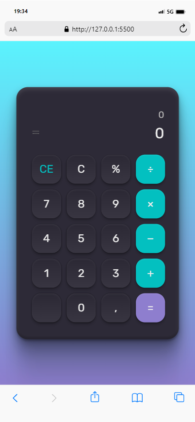

# Calculadora

Primeiro projeto prática aplicado na criação de uma calculadora.

## Stack utilizada

**Front-end:** HTML, CSS e JS

## Deploy

[LINK](https://felipepleao.github.io/practical-PersonalProjects/01-calculadora/).

## Screenshots

## Gif
