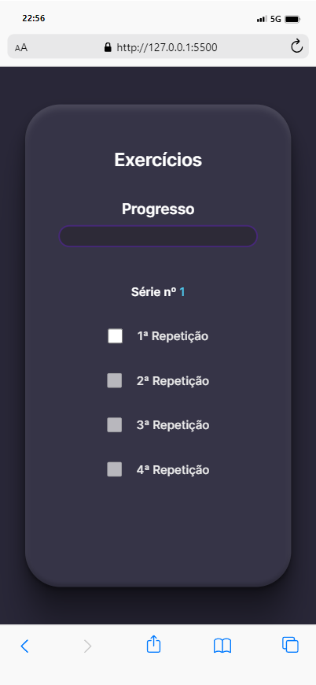

# Controle de Desenvolvimento de Exercícios por Repetições e Séries

Este projeto tem como objetivo acompanhar o progresso de exercícios por meio de repetições e séries. Ele inicia com uma série e avança até quatro séries, cada uma composta por quatro repetições.

## Stack utilizada

**Front-end:** HTML, CSS e JS

## Deploy

[LINK]().

## Screenshots

## Gif
