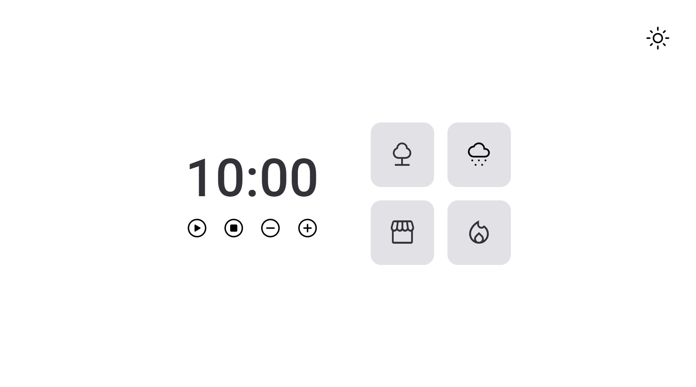

  <h1 align="center"> FocusTimer </h1>

  

    <a href="#-tecnologias">Tecnologias</a>&nbsp;&nbsp;&nbsp;|&nbsp;&nbsp;&nbsp;
    <a href="#-projeto">Projeto</a>&nbsp;&nbsp;&nbsp;|&nbsp;&nbsp;&nbsp;
    <a href="#-layout">Layout</a>&nbsp;&nbsp;&nbsp;|&nbsp;&nbsp;&nbsp;
  

   
   
  

  ## 🚀 Tecnologias

  Esse projeto foi desenvolvido com as seguintes tecnologias:

  - HTML, CSS e JS
  - Git e Github

  ## 💻 Projeto

  Este projeto consiste em interligar HTML e CSS com o DOM JavaSCript.

