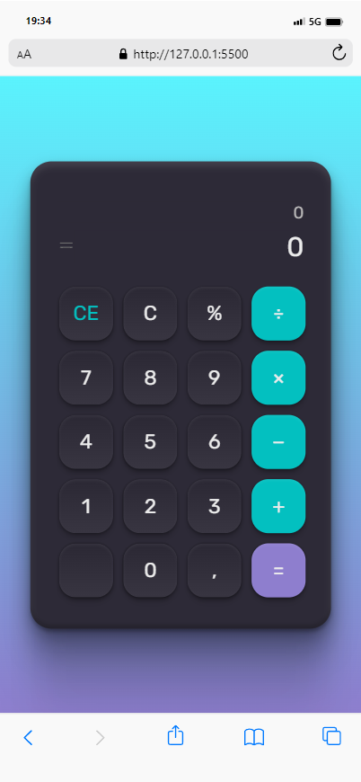
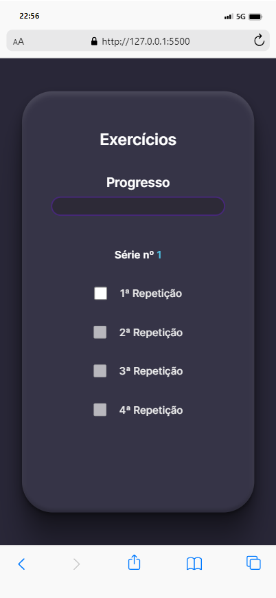

  # Projetos autorias

  <h1 align="center"> Projetos realizados para fixar conhecimentos </h1>
  

  Realizados por: Felipe Leão
  

  

    <a href="#-Calculadora">Calculadora</a>&nbsp;&nbsp;|&nbsp;&nbsp;
    <a href="#-">Calculadora</a>&nbsp;&nbsp;|&nbsp;&nbsp;
    
  

 
   
   

  ## Calculadora  
  ### HTML, CSS e JS

  > Projeto desenvolvido com as seguintes tecnologias:
      
  > Link do projeto:
  > [Projeto](https://github.com/felipepleao/practical-PersonalProjects/tree/main/01-calculadora)

  ## Deploy

  [LINK](https://felipepleao.github.io/practical-PersonalProjects/01-calculadora/).

  ## Screenshots

  

   

  ## "Controle de Desenvolvimento de Exercícios por Repetições e Séries" 
  ### HTML, CSS e JS

  > Projeto desenvolvido com as seguintes tecnologias:
      
  > Link do projeto:
  > [Projeto](https://github.com/felipepleao/practical-PersonalProjects/tree/main/02-serieExercicios)

  ## Deploy

  [LINK](https://felipepleao.github.io/practical-PersonalProjects/02-serieExercicios/).

  ## Screenshots

  

   
